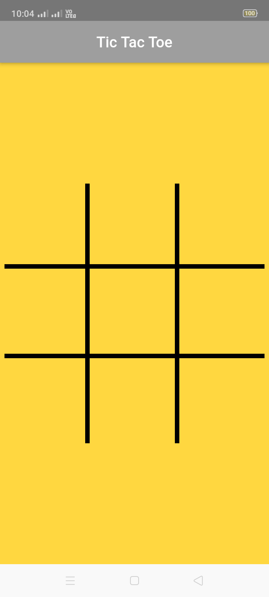
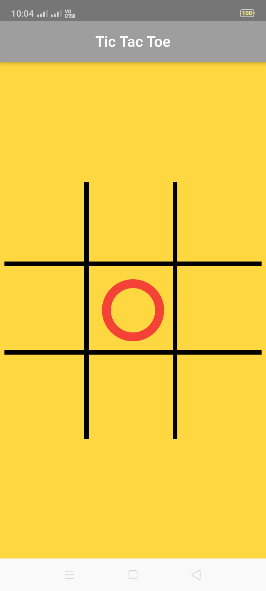
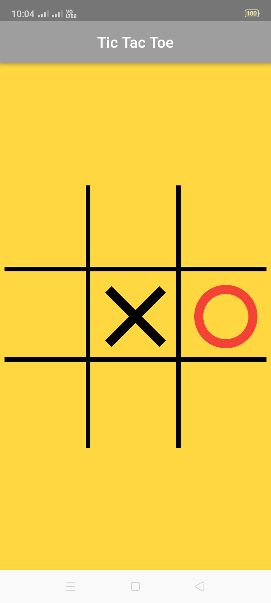

# Tic_Tac_Toe_In_Flutter

  This project is about how can we make Tic Tac Toe game in Flutter using canvas with winnig line showing. 
  In this code no dependency is require. Simple and streight forward game using simple codes in canvas. Let's start how can we make it.
  
  Here I highlight UI part. And for logic you can go with my code which I upload here.
  
 <p align="center">
   </p>
  
  
  
  ```
    //1st horizontal line.
    canvas.drawLine(
      Offset(STROKE_WIDTH, _dividedSize - HALF_STROKE_WIDTH),
      Offset(size.width - STROKE_WIDTH, _dividedSize - HALF_STROKE_WIDTH),
      blackPaint,
    );

    //2nd horizontal line.
    canvas.drawLine(
        Offset(STROKE_WIDTH, _dividedSize * 2 - HALF_STROKE_WIDTH),
        Offset(size.width - STROKE_WIDTH, _dividedSize * 2 - HALF_STROKE_WIDTH),
        blackPaint);

    //1st vertical line.
    canvas.drawLine(
      Offset(_dividedSize - HALF_STROKE_WIDTH, STROKE_WIDTH),
      Offset(_dividedSize - HALF_STROKE_WIDTH, size.height - STROKE_WIDTH),
      blackPaint,
    );

    //2nd vertical line.
    canvas.drawLine(
      Offset(_dividedSize * 2 - HALF_STROKE_WIDTH, STROKE_WIDTH),
      Offset(_dividedSize * 2 - HALF_STROKE_WIDTH, size.height - STROKE_WIDTH),
      blackPaint,
    );

```
<p align="center">
   </p>
 

```
   //Draw O.

  void drawNought(Canvas canvas, int index, Paint paint) {
    double left = (index % 3) * _dividedSize + DOUBLE_STROKE_WIDTH * 2;
    double top = (index ~/ 3) * _dividedSize + DOUBLE_STROKE_WIDTH * 2;
    double noughtSize = _dividedSize - DOUBLE_STROKE_WIDTH * 4;

    canvas.drawOval(Rect.fromLTWH(left, top, noughtSize, noughtSize), paint);
  }

```

<p align="center">
   </p>
 
 
```
 //Draw X.

  void drawCross(Canvas canvas, int index, Paint paint) {
    double x1, y1;
    double x2, y2;

    x1 = (index % 3) * _dividedSize + DOUBLE_STROKE_WIDTH * 2;
    y1 = (index ~/ 3) * _dividedSize + DOUBLE_STROKE_WIDTH * 2;

    x2 = (index % 3 + 1) * _dividedSize - DOUBLE_STROKE_WIDTH * 2;
    y2 = (index ~/ 3 + 1) * _dividedSize - DOUBLE_STROKE_WIDTH * 2;

    canvas.drawLine(Offset(x1, y1), Offset(x2, y2), paint);

    x1 = (index % 3 + 1) * _dividedSize - DOUBLE_STROKE_WIDTH * 2;
    y1 = (index ~/ 3) * _dividedSize + DOUBLE_STROKE_WIDTH * 2;

    x2 = (index % 3) * _dividedSize + DOUBLE_STROKE_WIDTH * 2;
    y2 = (index ~/ 3 + 1) * _dividedSize - DOUBLE_STROKE_WIDTH * 2;

    canvas.drawLine(Offset(x1, y1), Offset(x2, y2), paint);
  }

```


```void drawWinningLine(Canvas canvas, List<int> winningLine, Paint paint) {
    if (winningLine == null) return;

    double x1 = 0, y1 = 0;
    double x2 = 0, y2 = 0;

    //determine the direction.
    int firstIndex = winningLine.first;
    int lastIndex = winningLine.last;

    if (firstIndex % 3 == lastIndex % 3) {
      //vertical line.
      x1 = x2 = firstIndex % 3 * _dividedSize + _dividedSize / 2;
      y1 = STROKE_WIDTH;
      y2 = _dividedSize * 3 - STROKE_WIDTH;
    } else if (firstIndex ~/ 3 == lastIndex ~/ 3) {
      //horizontal line.
      x1 = STROKE_WIDTH;
      x2 = _dividedSize * 3 - STROKE_WIDTH;
      y1 = y2 = firstIndex ~/ 3 * _dividedSize + _dividedSize / 2;
    } else {
      //diagonal line.
      if (firstIndex == 0) {
        x1 = y1 = DOUBLE_STROKE_WIDTH;
        x2 = y2 = _dividedSize * 3 - DOUBLE_STROKE_WIDTH;
      } else {
        x1 = _dividedSize * 3 - DOUBLE_STROKE_WIDTH;
        y1 = DOUBLE_STROKE_WIDTH;
        x2 = DOUBLE_STROKE_WIDTH;
        y2 = _dividedSize * 3 - DOUBLE_STROKE_WIDTH;
      }
    }

    //draw the winning line.
    canvas.drawLine(Offset(x1, y1), Offset(x2, y2), paint);
  }
  ```
